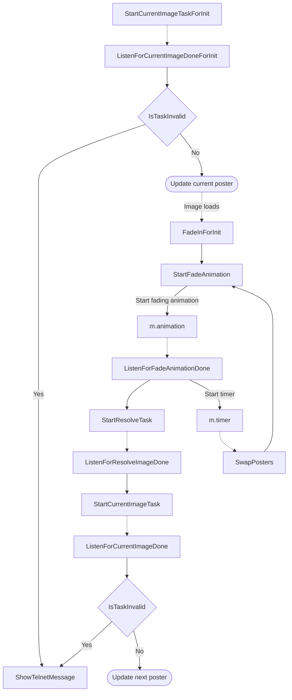

```mermaid
flowchart TD
  startCurrTaskInit[StartCurrentImageTaskForInit] -.-> listenStartCurrTaskInit[ListenForCurrentImageDoneForInit]
  listenStartCurrTaskInit --> initCheck{IsTaskInvalid}
  initCheck -->|Yes| showTelnet[ShowTelnetMessage]
  initCheck -->|No| updateCurrPosterInit([Update current poster])
  updateCurrPosterInit -.->|Image loads| fadeInit[FadeInForInit]
  fadeInit --> startFade[StartFadeAnimation]
  startFade -->|Start fading animation| animation[m.animation]
  animation -.-> listenAnimation[ListenForFadeAnimationDone]
  listenAnimation --> resolveTask[StartResolveTask]
  listenAnimation -->|Start timer| timer[m.timer]
  timer -.-> swap[SwapPosters]
  swap --> startFade
  resolveTask -.-> listenResolveTask[ListenForResolveImageDone]
  listenResolveTask --> startCurrTask[StartCurrentImageTask]
  startCurrTask -.-> listenStartCurrTask[ListenForCurrentImageDone]
  listenStartCurrTask --> check{IsTaskInvalid}
  check -->|Yes| showTelnet
  check -->|No| updateNextPoster([Update next poster])
```
